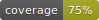

[](https://travis-ci.com/guifcoelho/Immu-table)



# Immu-table

Package for using immutable ndjson models instead of regular SQL or NoSQL databases with sintax similar to Laravel Eloquent.

DO NOT use this package if your models' data are likely to change.

# Installation

`composer require guifcoelho/immu-table`

# How to use it

## Configuration

The config class will look into a `config_path()` function and search for the `immutable.php` configuration file. Copy this file from `src/Config` to your own configuration folder.

By default, the tables are stored in `storage/app/immutable/tables`.

Also you can increase or decrese the `chunk_size` inside the configuration file. When loading the data, the Engine will do it in chunks as set in the configuration.

## Declaring your model

You should be able to create classes of models the same way as Laravel Eloquent:

```php
use guifcoelho\ImmuTable\Model;

class Sample extends Model
{
    protected $table = "table_example";
}
```

It will load your data from the table `table_example.ndjson` and set all fields accordingly. If you want to restrict the fields to be loaded, just include the protected array `$fields`:

```php
use guifcoelho\ImmuTable\Model;

class Sample extends Model
{
    protected $fields = ['id', 'name', 'email'];
}
```

If you do not want some fields to be returns in the `toArray()` or `toJson()` functions, just include their name as a protected array:

```php
use guifcoelho\ImmuTable\Model;

class Sample extends Model
{
    protected $hidden = ['created_at', 'updated_at'];
}
```

If you want your primary key to be anything but 'id', just declare as below (remember that your primary key must be unique and integer):

```php
use guifcoelho\ImmuTable\Model;

class Sample extends Model
{
    protected $primary_key = 'not_id';
}
```

## Querying your models

You can query your model for data the same way as in Laravel Eloquent:

```php
$query = SampleModel::where('id', 10)->first();
```

or,

```php
$query = SampleModel::where('price', '>', 50)->first();
```

or chaining 'where' clauses, 

```php
$query = SampleModel::where('price', '>', 50)->where('id', '<=', 10)->get();
```

or chaining 'orWhere' clauses

```php
$query = SampleModel::where('price', '>', 50)
            ->where('id', '<=', 10)
            ->orWhere('price', '<', 10)
            ->get();
```

After that, you can processes your that using functions from `\Illuminate\Support\Collection`.

## Declaring relationships

You can declare relationships between models the same way as Laravel Eloquent. Please, look into the `Model` class to see which relationships are implemented.

```php
use guifcoelho\ImmuTable\Model;

use Sample2;
use Sample3;

class Sample extends Model
{
    protected $table = "table_example";

    public function owner(){
        return $this->belongToOne(Sample2::class);
    }

    public function owned(){
        return $this->hasMany(Sample3::class);
    }
}
```

Following the example above, if the reference to the owner model is not 'sample2_id', then you need to declare it:

```php
public function owner(){
    return $this->belongToOne(Sample2::class, 'owner');
}
```

Also, you might want to reference the owner model using another field:

```php
public function owner(){
    return $this->belongToOne(Sample2::class, 'owner', 'not_id');
}
```

Now, looking at the owner model side, if the owned mode does not want to name the reference as 'sample_id':

```php
public function owned(){
    return $this->hasMany(Sample3::class, 'owner');
}
```

Also you might want to reference some field other than the 'id':

```php
public function owned(){
    return $this->hasMany(Sample3::class, 'owner', 'not_id');
}
```


# Testing

1. Without Docker
   - Only tests: `./vendor/bin/phpunit`
   - Tests and coverage report: `composer tests-report-[linux|win]`
2. With Docker
   - `cd docker`
   - `bash build`
   - Only tests: `bash composer tests-[linux|win]`
   - Tests and coverage report: `bash composer tests-report-[linux|win]`
